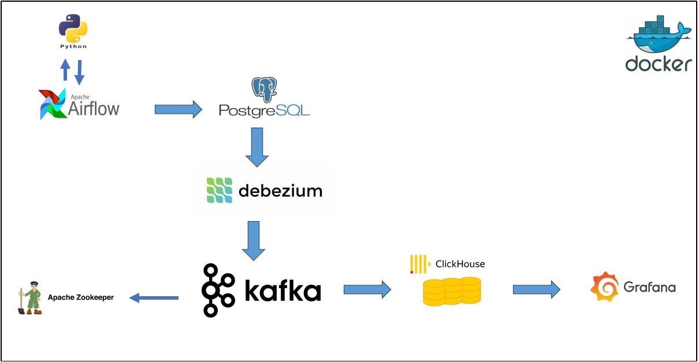
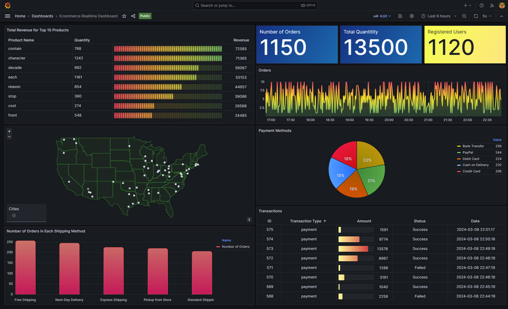

# E-Commerce Realtime Data Streaming

The main goal of this project is to cover a set of preliminary skills required by a data engineer. As a data Scientist planning to switch into this field, this project involves understanding and implementing various data engineering concepts, techniques, and technologies. As a result, I have decided to share my experiences. I hope you enjoy.

---
## Introduction

This project employs several key technologies to establish an end-to-end data processing pipeline for an online store environment. The workflow starts by simulating ecommerce data and populate the database by using Faker library. This raw data is subsequently channeled through Apache Airflow for data orchestration and storage in a PostgreSQL database.

The data is then streamed through Apache Kafka in conjunction with Apache Zookeeper to facilitate real-time data movement from PostgreSQL to ClickHouse as an analytical database.
Subsequently, ClickHouse is utilized to process incoming data and update downstream tables in real-time, facilitating timely insights and analysis within the data pipeline.

Finally,I utilized Grafana for real-time visualization of data and demonstrating the capabilities of ClickHouse and the features employed for analytical purposes.

The entire pipeline is encapsulated within Docker containers, affording a streamlined and portable deployment mechanism.

## System Architecture


<div style="text-align: center">

</div>


## Technologies

**1- Python:**

In this project, [Python](https://www.python.org/) served as the primary programming language. Python is widely used in data engineering projects due to its versatility, extensive libraries, and ease of use. To generate ecommerce data for the pipeline, I utilized the Faker library. Faker is a Python library that generates fake data, such as names, addresses, and product information, which is useful for testing and development purposes. Additionally, I employed the `geopy.geocoders` module, specifically the `Nominatim` class, to generate coordinates for each city where user orders were registered. This allowed for the geocoding of location data, enabling geographic analysis and visualization within the project. You can access the code I used to generate fake data in "[code/ecommerce/models](https://github.com/MaryamRamezaniGithub/ecommerce_project/tree/main/code/ecommerce/models)".

**2- Apache Airflow:**

[Apache Airflow](https://airflow.apache.org/) is an open-source tool that is great in orchestrating complex data pipelines. By defining Directed Acyclic Graphs (DAGs) including the sequence of tasks and their dependencies, I could automate the process of simulating data and executing tasks reliably and at scale. By applying Airflow's scheduling capabilities, I ensured efficient management of data processing tasks, ensuring timely execution and handling of dependencies between different components of the pipeline. The DAGs used in this project are available at "[pipeline/dags](https://github.com/MaryamRamezaniGithub/ecommerce_project/tree/main/pipeline/dags)".

**3- PostgreSQL:**

[PostgreSQL](https://www.postgresql.org/) served as the Online Transaction Processing (OLTP) database in this project and was used to store transactional data. To begin, I meticulously created a database schema, which was then implemented within PostgreSQL. Connectivity to PostgreSQL was established using the psycopg2 library, it allows Python programs to connect to a PostgreSQL database, perform database operations, and manage database transactions. Furthermore, the SQL script utilized for creating the database tables can be accessed in "[database/postgres_tables.sql](https://github.com/MaryamRamezaniGithub/ecommerce_project/blob/main/database/postgres_tables.sql)".

**4- Debezium and Apache Kafka:**

[Debezium](https://debezium.io/), utilized as a [Kafka](https://kafka.apache.org/) source connector in this project, it provides Change Data Capture (CDC) functionality from PostgreSQL to Apache Kafka. This seamless integration ensures that Kafka consumers have access to the most up-to-date information for further processing and analysis within the data pipeline.

Kafka's architecture allows it to handle large volumes of data with high fault tolerance and scalability. By using Debezium and Kafka together, the project gains robust real-time data streaming capabilities, making it possible to process and analyze data as soon as changes occur in the PostgreSQL database. The Debezium connector configurations are available as a JSON file at "[docker/debezium/init-scripts/postgres-connector.json](https://github.com/MaryamRamezaniGithub/ecommerce_project/blob/main/docker/debezium/init-scripts/postgres-connector.json)".


**5- ClickHouse:**

In this project, [ClickHouse](https://clickhouse.com/) serves as the analytical database, seamlessly connected to Kafka through the Kafka engine. By employing ClickHouse's capabilities, I utilized various features to enhance data processing and analysis. Specifically, I employed the MergeTree family table engine, which includes versatile table types such as MergeTree, SummingMergeTree, and AggregatingMergeTree. The MergeTree engine is well-suited for time-series data and offers efficient storage and querying capabilities, making it ideal for handling large volumes of streaming data.In addition, the SummingMergeTree and AggregatingMergeTree table engines provide aggregation capabilities.

Furthermore, ClickHouse's Materialized Views feature played an important role in the project, effectively acting as triggers for real-time data updates. Materialized views in ClickHouse allow for the precomputation and storage of query results, ensuring fast access to frequently accessed data. By defining materialized views on the Kafka table engine, I could efficiently process incoming data and update downstream tables in real-time, facilitating timely insights and analysis within the data pipeline.

Additionally, materialized views in ClickHouse offer flexibility in defining refresh intervals, ensuring that data remains up-to-date and accurate for analytical purposes. Moreover, I applied ClickHouse's Kafka engine integration to seamlessly ingest data from Kafka topics into ClickHouse tables. For continuously reading data from Kafka topics, I utilized ClickHouse's "materialized view" functionality, ensuring real-time updates and insights into the data pipeline.

The tables used for analytical purposes in the project start with `_at_` (at: analytical table). Similarly, the Materialized Views used to populate these tables start with `_mv_at_`. Furthermore, I implemented Time to Live (**TTL**) settings for some tables to automatically delete summarized data after a specified time, ensuring the freshness of data stored in the analytical tables.

**6- Grafana Dashboard:**

[Grafana](https://grafana.com/) served in this project primarily for real-time visualization of data. It connects to ClickHouse via the "[grafana-clickhouse-datasource](https://grafana.com/grafana/plugins/grafana-clickhouse-datasource/)" plugin. While the primary focus of this project is not on visualization, Grafana serves to demonstrate the capabilities of ClickHouse and the features employed for analytical purposes.

<div style="text-align: center">



</div>


**Note:** Upon running the project, you may notice that certain parts of the dashboard do not display information initially. Only the "Registered Users" panel will contain data. This is due to the fact that order and transaction information is generated gradually, with data from 10 users initially stored in the database. You can adjust this behavior by modifying the code in "[code/ecommerce/models/role_user.py](https://github.com/MaryamRamezaniGithub/ecommerce_project/blob/main/code/ecommerce/models/role_user.py)".

**7- Docker (docker-compose):**

I utilized [docker-compose](https://docs.docker.com/compose/) to streamline the deployment and interconnection of various services essential for the project's functionality. The configuration defines a comprehensive suite of 13 services, encompassing "airflow," "kafka-broker," "zookeeper," "clickhouse," "debezium," "grafana," and others. Each service is carefully configured with relevant environment variables, port assignments, health checks, and dependencies, ensuring seamless integration within the stack. Furthermore, volumes are employed to persist data for services such as Kafka, ClickHouse, Grafana, and PostgreSQL. A dedicated network ("services") facilitates efficient communication among the deployed services. This docker-compose configuration optimizes the management of the project's tech stack, fostering streamlined development, deployment, and operation processes.

---

## Running the Project

#### Prerequisites:
- Ensure you have Docker and docker-compose installed on your system. If not, please follow the official [Docker](https://docs.docker.com/) installation guide for your operating system.

#### Step 1: Clone the Repository
1. Open your terminal.
2. Clone the project repository from GitHub to your local machine using the following command:

   ```
   git clone https://github.com/MaryamRamezaniGithub/ecommerce_project.git
   ```

#### Step 2: Navigate to Project Directory
1. Use the command line to navigate to the root directory of the project:

   ```
   cd ecommerce_pipeline
   ```

#### Step 3: Start Docker Containers
1. Execute the following command to start all services defined in the docker-compose file:
   
   ```
   docker-compose up -d
   ```
   This command will build and start the Docker containers for various services in your project.

#### Step 4: Monitor Service Initialization
1. During the startup process, monitor the console output to ensure all services are initialized successfully.
2. Pay attention to the initialization tasks performed by the `airflow-init` and `debezium-connector-init` containers.
   - The `airflow-init` container initializes Airflow and performs necessary setup tasks. After completing its initialization, this container will stop automatically.
   - The `debezium-connector-init` container creates a connector for Debezium, facilitating Change Data Capture (CDC) from PostgreSQL to Kafka. After creating the connector, this container will also stop automatically.
3. Once all initialization tasks are complete, ensure that other services continue to run without any errors or warnings.

These adjustments reflect the specific tasks performed by the `airflow-init` and `debezium-connector-init` containers during service initialization, providing clarity on their roles in the project setup process. If you have any further questions or need additional assistance, feel free to ask!
#### Step 5: Access Project Services
1. Open a web browser and navigate to the following URLs to access various project services:
   - **Airflow UI:** `http://localhost:13005` username:`airflow`, password:`airflow`
   - **Debezium UI:** `http://localhost:8085` _(authentication not required)_
   - **Kafka UI:** `http://localhost:8095/` _(authentication not required)_
   - **Grafana Dashboard:** `http://localhost:13000` username:`admin`, password:`admin`
   - **PostgreSQL:** port:`65432`, username:`postgres`, password:`postgres`
   - **ClickHouse:** port:`8123`, username:`default`, password: _(not required)_


## Things to learn
1. Establishing a data pipeline using Apache Airflow for workflow orchestration and data management.
2. Implementing real-time data streaming through Apache Kafka to facilitate data transfer and processing in real-time.
3. Enabling distributed synchronization using Apache Zookeeper for robust coordination and reliability in a distributed system.
4. Utilizing data storage solutions with PostgreSQL and ClickHouse to securely store and manage structured data.
5. Creating real-time dashboards that provide insights into the data and system performance.
6. Containerizing the entire data engineering infrastructure with Docker to ensure portability and ease of deployment across various environments.
